# Welcome to **Linux**!
Описание на русском [тут](./README_RUS.md)

1. [Part 1. OS installation](#part-1-installing-the-osn)
2. [Part 2. Creating a user](#part-2-creating-a-user)
3. [Part 3. OS Network Setup](#part-3-configuring-the-os-network)
4. [Part 4. OS Update](#part-4-os-update)
5. [Part 5. Using the sudo command](#part-5-using-the-sudo-command)
6. [Part 6. Installing and configuring the Time Service](#part-6-installing-and-configuring-the-time-service)
7. [Part 7. Installing and using text editors](#part-7-installing-and-using-text-editors-vim-nano-mcedit)
8. [Part 8. Installation and basic configuration of the SSHD service](#part-8-installation-and-basic-configuration-of-the-sshd-service)
9. [Part 9. Installing and using top, htop utilities](#part-9-installing-and-using-the-top-htop-utilities)
10. [Part 10. Using the fdisk utility](#part-10-using-the-fdisk-utility)
11. [Part 11. Using the df utility](#part-11-using-the-df-utility)
12. [Part 12. Using the du utility](#part-12-using-the-du-utility)
13. [Part 13. Installing and using the ncdu utility](#part-13-installing-and-using-the-ncdu-utility)
14. [Part 14. Working with system logs](#part-14-working-with-system-logs)
15. [Part 15. Using the CRON Task Scheduler](#part-15-using-the-task-scheduler-cron)

##  Part 1. Installing the OS
* Installing Ubuntu 20.04 Server LTS.
* Output of the Ubuntu version using the `cat /etc/issue` command : 

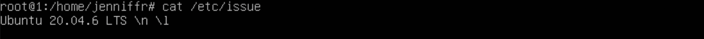

## Part 2. Creating a user
* Create a new user `admin`:

* Adding the user `admin` to the 'adm` group

* We output users with the command `cat /etc/passwd`, look at the presence of the user `admin` there:

## Part 3. Configuring the OS network
* `lo` is an interface that allows programs to access through a local host or send data to themselves. This is useful for testing and setting up network functions.
* `DHCP` is a network protocol for dynamically configuring network parameters. It was created so that you do not have to manually set IP, DNS, and so on for each device.
* First, go to the *** superuser*** so as not to type `sudo` every time and use it further in all tasks. 
* Use `ip route` to get the gateway address, set static parameters in the file `/etc/netplan/*.yaml`, apply the changes `netplan apply`, reboot the machine `reboot`, check that the specified parameters are preserved.
* Ping 1.1.1.1 and ya.ru: 

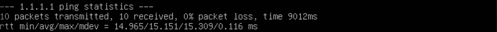

## Part 4. OS Update
* Check for `apt update' updates, install `apt upgrade`: 

## Part 5. Using the **sudo command**
* `sudo` is used to execute commands on behalf of the superuser. The superuser has full control over the system.   
* Add the user `admin` to the `sudo' group and switch to it, change the hostname. Result:

## Part 6. Installing and configuring the Time service
* If auto-synchronization of time is not enabled, turn it on. Result: 

## Part 7. Installing and using text editors VIM, NANO, MCEDIT
* VIM, to exit with saving :wq

* NANO, to exit with saving `Ctrl + O`

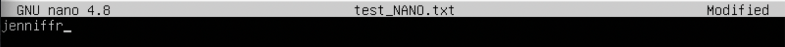
* MCEDIT, to exit with saving `Esc + 0` , `Y`

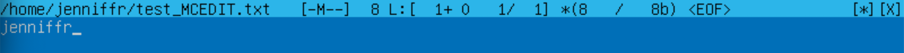

* VIM, to exit without saving `:q!`

* NANO, to exit without saving `Ctrl + X` , `N`

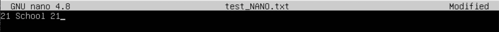
* MCEDIT, to exit without saving `Esc + 0` , `N`

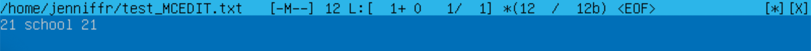

* VIM, search for `/jenniffr` and replace `:s/jenniffr/21 School 21/g`

* NANO, search for `Ctrl + W` and replace `Ctrl +\`

* MCEDIT, search for `Esc + 7` and replace `Esc + 4`

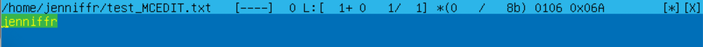
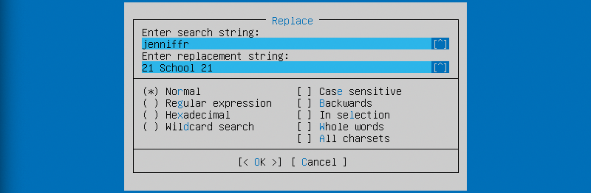

## Part 8. Installation and basic configuration of the SSHD service  
* Install ssh, add it to autorun, look at running processes using `ps -ef` 
    - ps: running processes
- -e: processes of all users
- -f: complete information about each process

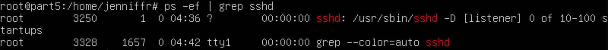

* Using `netstat -tan`
    - `netstat` - disables network connections
- `-t` - TCP connections only
- `-a` - display all connections
    - `-n` - display addresses and addresses in numerical representation, without converting to names

* Command output:
- `Proto` - Connection protocol.
    - `Recv-Q` - The number of bytes waiting to be read from the socket.
    - `Send-Q` - The number of bytes waiting to be sent over the socket.
    - `Local Address' - The local IP address and port.
    - `Foreign Address' - Local IP address and port.
    - `State' - The state of the connection.
    - The address `0.0.0.0` means "all addresses on this device".

## Part 9. Installing and using the **top**, **htop utilities**
* Output `top`:
- uptime = 46 min
- number of authorized users = 1 
  - total system load = 0.00
- total number of processes = 95
  - CPU usage = 0.00
- memory usage = 146.9
- pid of the process taking up the most memory = 657
- pid of the process taking up the most CPU time = 1559

* 'htop` screenshots: 

  - sorted by PID, PERCENT_CPU, PERCENT_MEM, TIME

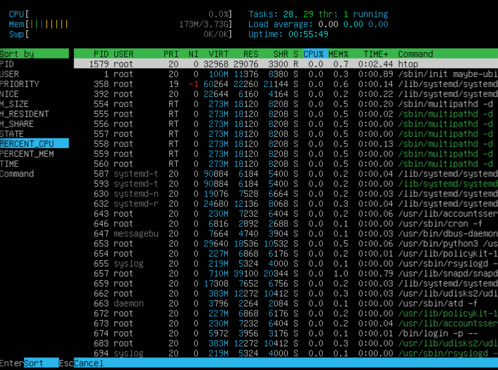
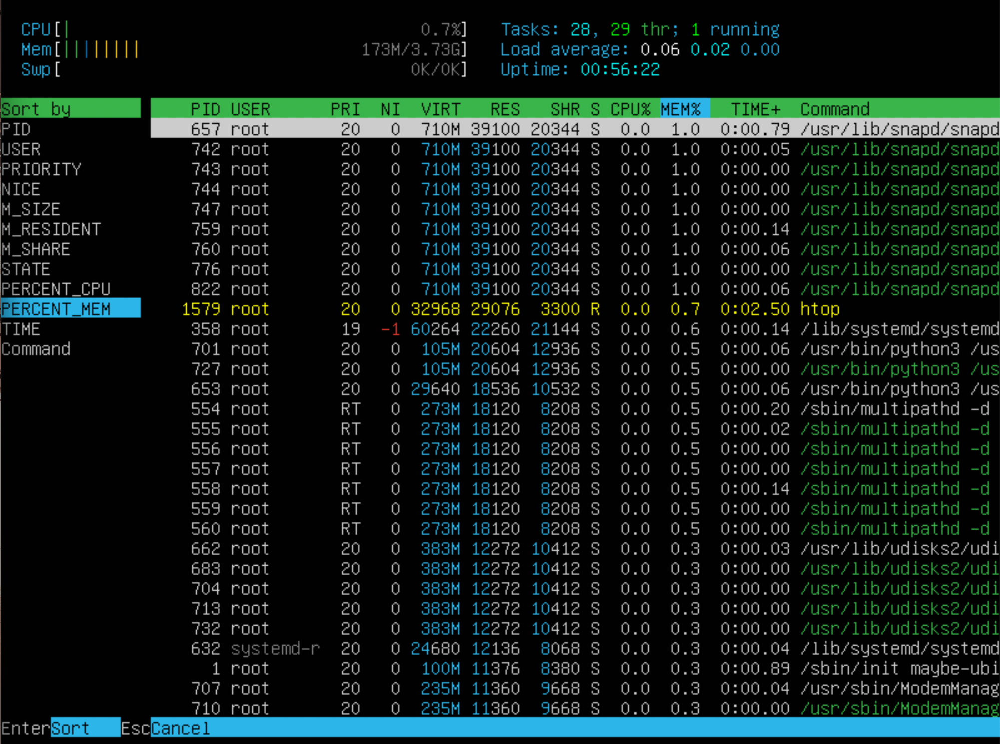
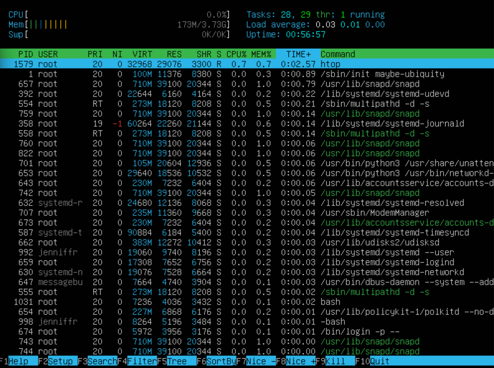

  - filtered for the sshd process

- with the syslog process found using the search 

- with added output of hostname, clock and uptime  

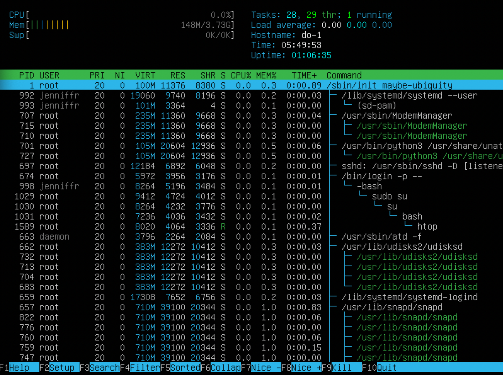

## Part 10. Using the fdisk utility
* Using the `fdisk -l` command, we will find out: 
    - Disk name = /dev/sda
- Size = 10GiB
    - SECTORS = 20971520

## Part 11. Using the df utility
* Using the `df` command, we find out the data about the root partition (measured in kilobytes (K))
- partition size = 8408452
  - the size of the OCCUPIED SPACE = 2594036
  - free space size = 5365700
- percentage of usage = 33% 
* Using the `df -Th` command, we find out the data about the root partition (measured in gigabytes (G))
- partition size = 8.1
- occupied space size = 2.5
- free space size = 5.2
- percentage of usage = 33%
- file system type = ext4"

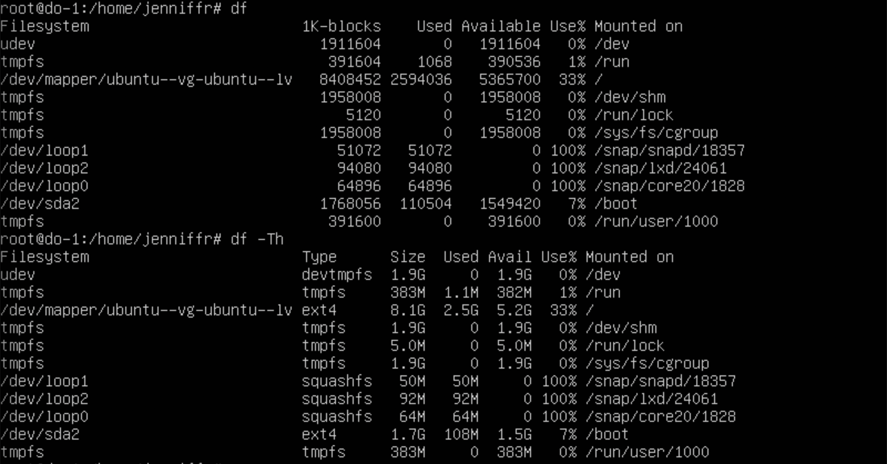
  
## Part 12. Using the du utility
* Output of `du` commands:

* Output the contents of `/var/log/*`

## Part 13. Installing and using the ncdu utility
* Output folder sizes using `ncdu`
- `/home`

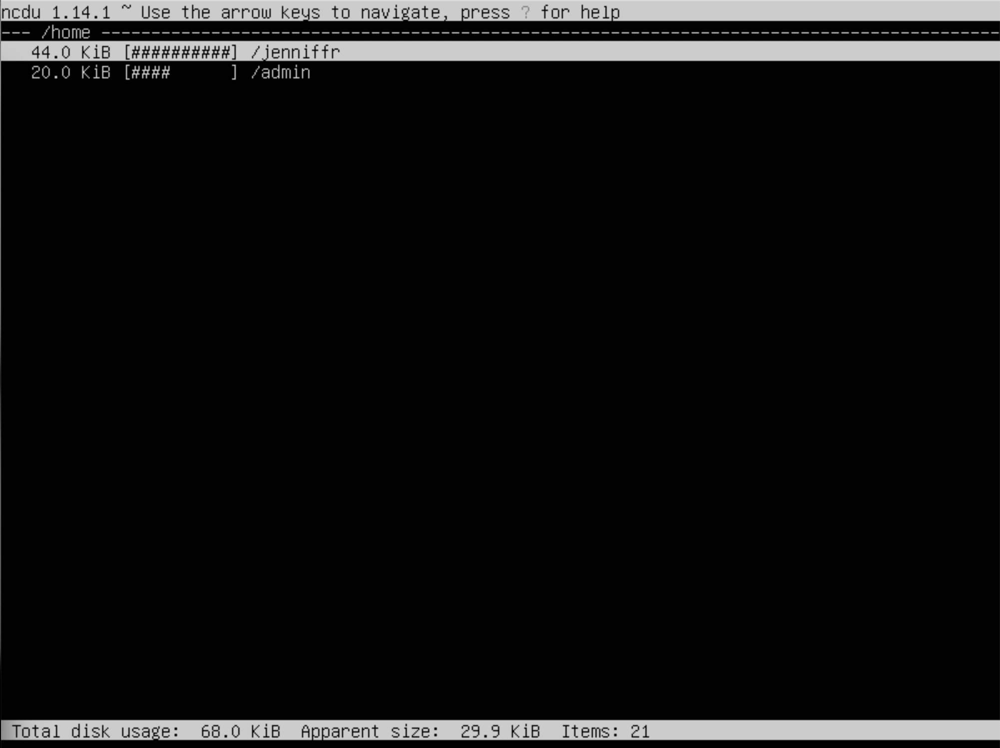
- `/var`

- `/var/log`

## Part 14. Working with system logs
* Last login = Jan 25 07:04 , user = jenniffr, login method = tty1

* Restart SSHd: 

## Part 15. Using the Task Scheduler **CRON**

* Add uptime to the task list every 2 minutes. Log output + cron task list: 

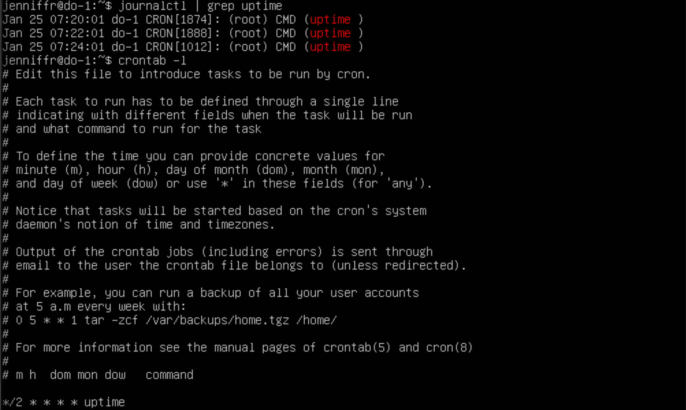

* Deleting all tasks from cron: 

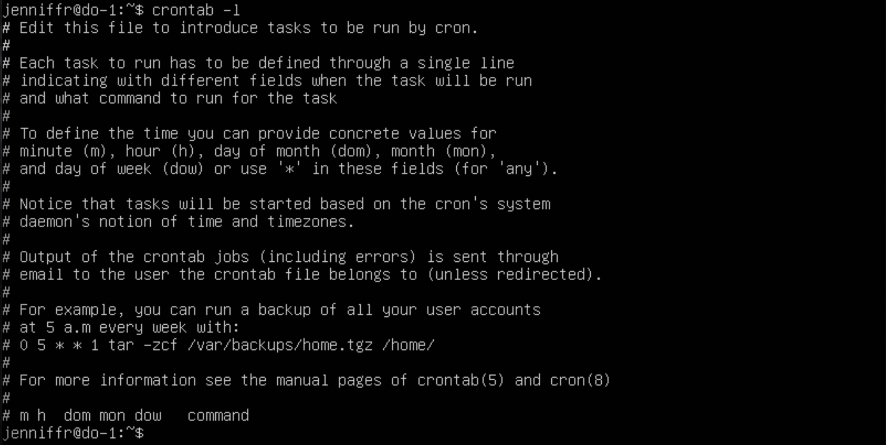

If you're reading this, know this: you're doing great)

----------------------------------------------
***Thank you for your time.***