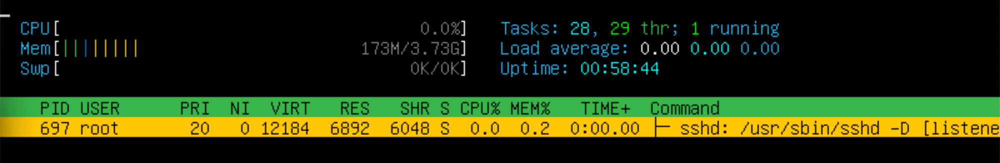

#   Добро пожаловать в **Linux**!

English readme [here](./README.md)

1. [Part 1. Установка ОС](#part-1-установка-ос)
2. [Part 2. Создание пользователя](#part-2-создание-пользователя)
3. [Part 3. Настройка сети ОС](#part-3-настройка-сети-ос)
4. [Part 4. Обновление ОС](#part-4-обновление-ос)
5. [Part 5. Использование комнады sudo](#part-5-использование-команды-sudo)
6. [Part 6. Установка и настройка службы времени](#part-6-установка-и-настройка-службы-времени)
7. [Part 7. Установка и использование текстовых редакторов](#part-7-установка-и-использование-текстовых-редакторов-vim-nano-mcedit)
8. [Part 8. Установка и базовая настройка сервиса SSHD](#part-8-установка-и-базовая-настройка-сервиса-sshd)
9. [Part 9. Установка и использование утилит top, htop](#part-9-установка-и-использование-утилит-top-htop)
10. [Part 10. Использование утилиты fdisk](#part-10-использование-утилиты-fdisk)
11. [Part 11. Использование утилиты df](#part-11-использование-утилиты-df)
12. [Part 12. Использование утилиты du](#part-12-использование-утилиты-du)
13. [Part 13. Установка и использование утилиты ncdu](#part-13-установка-и-использование-утилиты-ncdu)
14. [Part 14. Работа с системными журналами](#part-14-работа-с-системными-журналами)
15. [Part 15. Использование планировщика заданий CRON](#part-15-использование-планировщика-заданий-cron)

##  Part 1. Установка ОС
* Установка Ubuntu 20.04 Server LTS.
* Вывод версии Ubuntu посредством команды `cat /etc/issue` : 

## Part 2. Создание пользователя
* Cоздание нового пользователя `admin`:

* Добавляем пользователя `admin` в группу `adm`

* Выводим пользователей командой `cat /etc/passwd`, смотрим наличие там пользователя `admin`:

## Part 3. Настройка сети ОС
* `lo` - интерфейс позволяющий обращаться программам через локальный хост или посылать данные самому себе. Это полезно для тестирования и наладки сетевых функций.
* `DHCP` - сетевой протокол для динамической настройки сетевых параметров. Создан, чтобы не нужно было вручную каждому устройству задавать IP , DNS и тд.
* Для начала переходим к ***суперпользователю*** чтобы не вводить `sudo` каждый раз и используем далее во всех заданиях. 
* Используем `ip route` чтобы получить адресс шлюза, задаем статические параметры в файле `/etc/netplan/*.yaml` , применяем изменения `netplan apply`, перезагружаем машину `reboot`, проверяем что заданные параметры сохранились.
* Пингуем 1.1.1.1 и ya.ru: 

## Part 4. Обновление ОС
* Проверяем обновления `apt update`, устанавливаем `apt upgrade`: 

## Part 5. Использование команды **sudo**
* `sudo` испльзуется для выполнения команд от имени суперпользователя. Суперпользователь имеет полный контроль над системой.   
* Добавляем пользователя `admin` в группу `sudo` и переключаемся на него, меняем имя хоста. Результат:

## Part 6. Установка и настройка службы времени
* Если не включена автосинхронизация времени - включаем. Результат: 

## Part 7. Установка и использование текстовых редакторов VIM, NANO, MCEDIT
* VIM, для выхода c сохранением :wq

* NANO, для выхода c сохранением `Ctrl + O`

* MCEDIT, для выхода c сохранением `Esc + 0` , `Y`

* VIM, для выхода без сохранения `:q!`

* NANO, для выхода без сохранения `Ctrl + X` , `N`

* MCEDIT, для выхода без сохранения `Esc + 0` , `N`

* VIM, поиск `/jenniffr` и замена `:s/jenniffr/21 School 21/g`

* NANO, поиск `Ctrl + W` и замена `Ctrl + \`

* MCEDIT, поиск `Esc + 7` и замена `Esc + 4`

## Part 8. Установка и базовая настройка сервиса SSHD  
* Устанавливаем ssh, добавляем в автозапуск, смотрим в запущенных процессах с помощью `ps -ef` 
    - ps: запущенные процессы
    - -e: процессы всех пользователей
    - -f: полная информация о каждом процессе

* Используем `netstat -tan`
    - `netstat` - отобржает сетевые соединения
    - `-t` - только TCP-соединения
    - `-a` - отобразить все соединия
    - `-n` - отобразить адреса и проты в числовом представлении, не преобразовывая в имена

* Вывод команды: 
    - `Proto` - Протокол соединения.
    - `Recv-Q` - Количество байт ожидающих чтения из сокета.
    - `Send-Q` - Количество байт ожидающих отправки через сокет.
    - `Local Address` - Локальный IP-адресс и порт.
    - `Foreign Address` - Локальный IP-адресс и порт.
    - `State` - Сосотояние соединения.
    - Адрес `0.0.0.0` означает "все адреса на этом устройстве".

## Part 9. Установка и использование утилит **top**, **htop**
* Вывод `top`:
  - uptime = 46 мин
  - количество авторизованных пользователей = 1 
  - общая загрузка системы = 0.00
  - общее количество процессов = 95
  - загрузку cpu = 0.00
  - загрузку памяти = 146.9 
  - pid процесса занимающего больше всего памяти = 657
  - pid процесса, занимающего больше всего процессорного времени = 1559

* Скрины `htop`: 

  - отсортированно по PID, PERCENT_CPU, PERCENT_MEM, TIME

  - отфильтрованно для процесса sshd

  - с процессом syslog, найденным, используя поиск 

  - с добавленным выводом hostname, clock и uptime  

## Part 10. Использование утилиты fdisk
* С помощью команды  `fdisk -l` узнаем: 
    - Название диска = /dev/sda
    - Размер = 10GiB
    - Секторов = 20971520

## Part 11. Использование утилиты df
* С помощью команды `df` узнаем данные о корневом разделе (измеряется в килобайтах (К))
  - размер раздела = 8408452
  - размер занятого пространства = 2594036
  - размер свободного пространства = 5365700
  - процент использования = 33% 
* С помощью команды `df -Th` узнаем данные о корневом разделе (измеряется в гигабайтах (G))
    - размер раздела = 8.1
    - размер занятого пространства = 2.5
    - размер свободного пространства = 5.2
    - процент использования = 33%
    - тип файловой системы = ext4›

  
## Part 12. Использование утилиты du
* Вывод команд `du`:

* Вывод содержимого `/var/log/*`

## Part 13. Установка и использование утилиты ncdu
* Выводим размеры папок с помощью `ncdu`
- `/home`

- `/var`

- `/var/log`

## Part 14. Работа с системными журналами
* Последняя авторизация = Jan 25 07:04 , пользователь = jenniffr, метод входа = tty1

* Рестарт SSHd: 

## Part 15. Использование планировщика заданий **CRON**

* Добавляем в список задач uptime каждые 2 минуты. Вывод журнала + список задач cron: 

* Удаляем все задания из cron: 

Если ты читаешь это, знай: ты молодец)

----------------------------------------------
***Спасибо за уделенное время.***